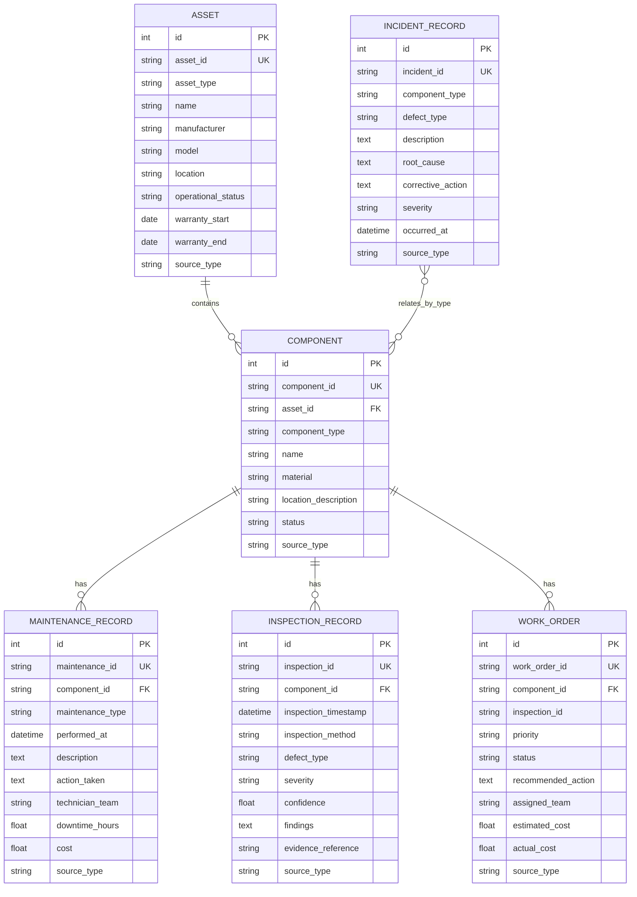

# Phase 2B: Historical Context & Asset Intelligence Foundation

## 1. Overview & Architecture
Phase 2B establishes the relational asset intelligence layer of the **Agentic AI for Autonomous Industrial Inspection** system.

It provides persistent historical context (asset specifications, inspectable component hierarchies, chronological maintenance logs, prior inspection records, active/past work orders, and related failure incident reports) stored in **PostgreSQL** via **SQLAlchemy 2.x** and version-controlled via **Alembic**.

```text
POSTGRESQL ASSET REPOSITORY
  ├── assets (Parent physical assets, locations, warranties)
  ├── components (Inspectable segments, materials, health states)
  ├── maintenance_records (Services, repairs, coatings, downtime)
  ├── inspection_records (Prior visual, ultrasonic, or autonomous findings)
  ├── work_orders (Past work orders, remediation actions, costs)
  └── incident_records (Historical structural failure incidents)
         ↓
HISTORICAL CONTEXT SERVICES (context_service.py)
         ↓
HISTORICAL CONTEXT CONTRACT (HistoricalContext v1.0)
         ├── GET /api/v1/components/{component_id}/context (API Endpoint)
         ├── get_maintenance_history (BaseAgentTool)
         └── get_component_context (BaseAgentTool)
```

---

## 2. Relational Entity Architecture



---

## 3. Versioned Historical Context Contract (`HistoricalContext` v1.0)

Pydantic v2 schema: `backend/app/schemas/context.py`
- `schema_version`: `"1.0"`
- `retrieved_at`: UTC timestamp
- `component`: `ComponentRead`
- `asset`: `AssetRead`
- `maintenance_history`: `List[MaintenanceRecordRead]`
- `previous_inspections`: `List[InspectionRecordRead]`
- `previous_work_orders`: `List[WorkOrderRead]`
- `relevant_incidents`: `List[IncidentRecordRead]`
- `source_references`: Query metadata, counts, and database provider
- `is_synthetic_data`: Boolean flag identifying development records

---

## 4. Implemented Agent Tools

1. **`GetMaintenanceHistoryTool`** (`backend/app/tools/maintenance_history.py`):
   - Implements `BaseAgentTool`
   - Input: `MaintenanceHistoryInput(component_id: str)`
   - Output: `MaintenanceHistoryOutput(component_id, found, maintenance_count, latest_service_date, records)`
2. **`GetComponentContextTool`** (`backend/app/tools/component_context.py`):
   - Implements `BaseAgentTool`
   - Input: `ComponentContextInput(component_id: str)`
   - Output: `ComponentContextOutput(component_id, found, context)`

---

## 5. Provenance & Synthetic Data Isolation
All development records created by `scripts/seed_development_database.py` are explicitly tagged with:
```python
source_type = "development_synthetic"
```
The context engine inspects these records and sets `is_synthetic_data = True`. This guarantees that the future LLM reasoning layer is aware when it is evaluating synthetic mock data versus certified industrial records.

---

## 6. Security, Database Safety & Migrations
- **Alembic Version Control**: All database DDL is managed through `alembic/versions/`.
- **Credential Protection**: `.env` is git-ignored; connection string template provided in `.env.example`.
- **SQL Injection Prevention**: 100% parameterized queries via SQLAlchemy 2.0 select statements.
- **Connection Pooling**: PostgreSQL connection pooling with pre-ping validation (`pool_size=10`, `max_overflow=20`, `pool_pre_ping=True`).
- **Clean Session Lifecycle**: `get_db()` context manager yields sessions with automatic rollback on unhandled exceptions and guaranteed connection release.

---

## 7. Future Phase 2 Roadmap & Integration Points
- **Phase 2B+ (Future RAG & Vector Retrieval)**:
  - Add `pgvector` extension to `incident_records` and asset manuals for semantic embedding retrieval.
- **Phase 2C (Future Claude Multi-Modal Agent)**:
  - Connect `VisionEvidence` v1.0 + `HistoricalContext` v1.0 into Claude tool-calling agent.
  - Draft automated maintenance work orders with human-in-the-loop approval.
